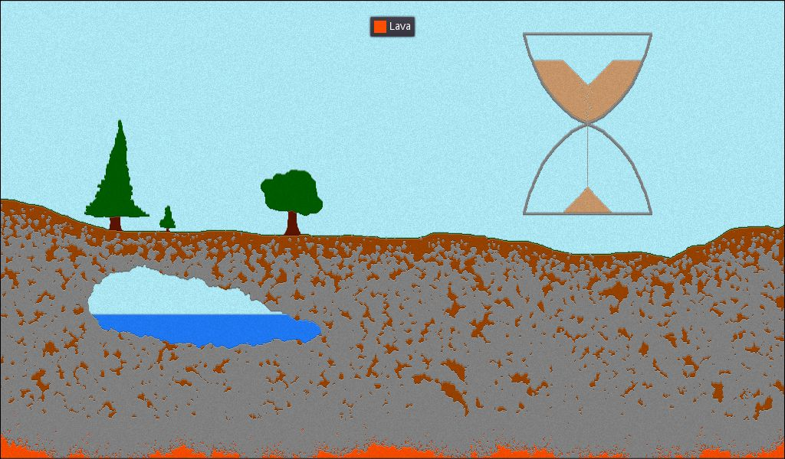

GPU Cellular Automata Template
==============================

GPU-accelerated cellular automata template in Godot.

Uses GLSL3, but it should be possible to run it on GLSL2 with minor tweaks.

## Controls

Scroll wheel = select material

Click = place material

Enter = pause/play

Space = step once

## How it works

The current state of the simulation is stored in a texture, rendered in a special
viewport named `Simulation/Viewport`.

A [simulation.shader](simulation.shader) reads the viewport to compute the next
frame and writes the result back to the same viewport.

Finally, the result is shaded through the [render.shader](render.shader) and
presented on the screen.

Setup and input are handled from [cellular_automata.gd](cellular_automata.gd).

## License

Copyright (c) 2021 Fabio Iotti. Released under the [MIT License](LICENSE).
